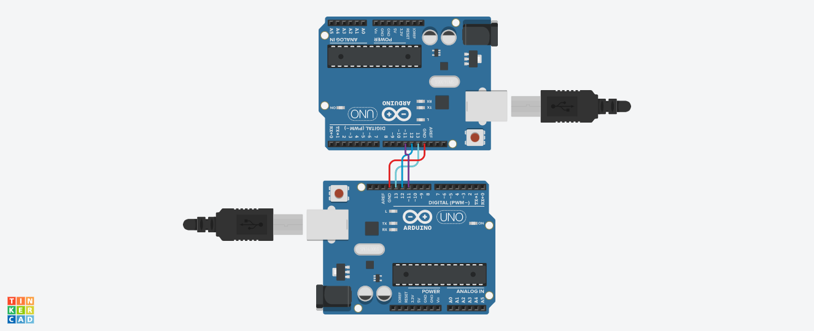

# Atividade com Arduíno — Camada de Enlace
Trabalho prático realizado para a disciplina de Redes de Computadores, SSC0142, durante o primeiro semestre letivo de 2022.

## Integrantes
- Erick Patrick Andrade Barcelos
- Karoliny Oliveira Ozias Silva
- João Lucas Rodrigues Constantino

## Especificações
O grupo assume a tarefa de recepção com paridade ímpar.

## Replicação
No código fonte, há um exemplar do emissor, que pode ser utilizado para testar o receptor. Para tanto, pode-se utilizar a virtualização de circuitos por meio do website [Tinkercad](https://www.tinkercad.com); nesse caso, construa um circuito como mostrado abaixo: 

Na seção de código, adicione os códigos de emissão e de recepção aos respectivos Arduinos; em cada caso, adicione também o conteúdo de Timer.h ao código para importação manual de suas funcionalidades.

## Apresentação da Simulação
<video width="1280" height="720" controls>
  <source src="./media/presentation.mp4" type="video/mp4">
</video>
